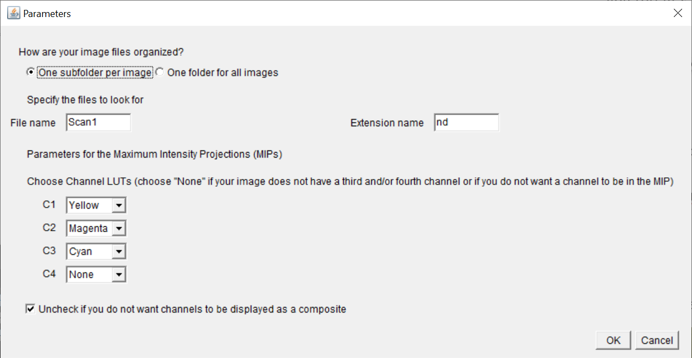
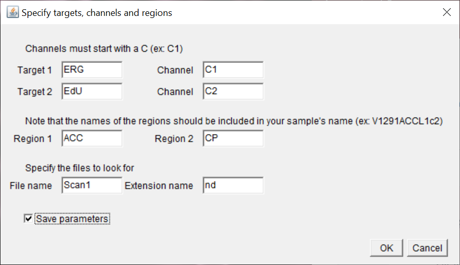
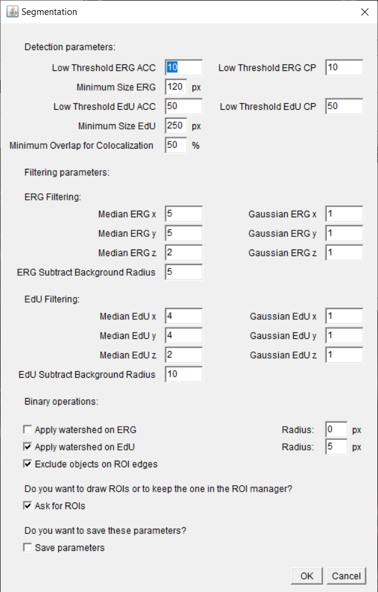
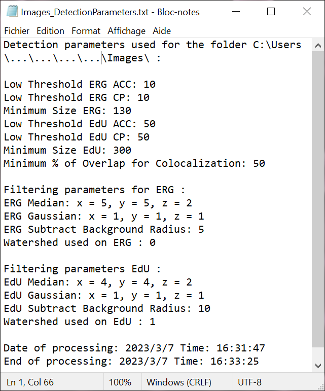
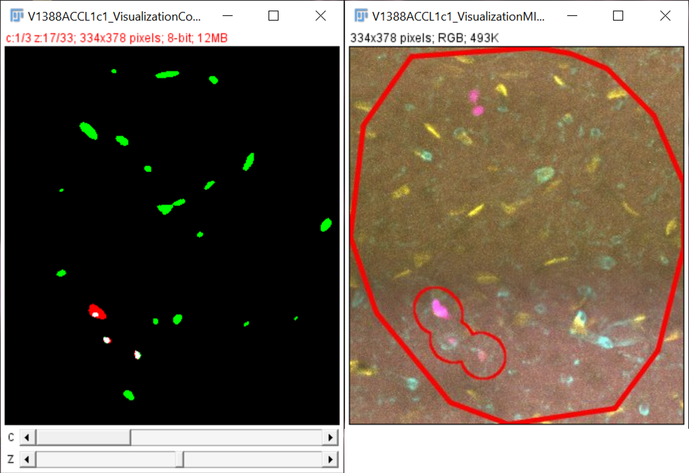
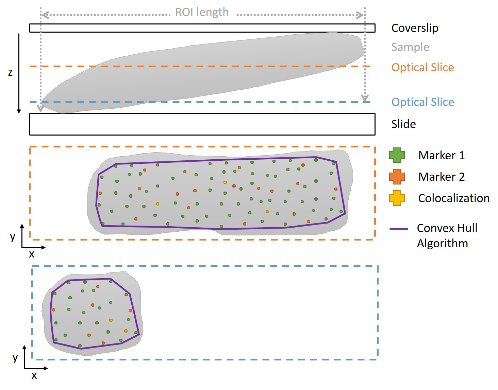

# Melodie's colocalization toolset
This 4 steps FIJI/ImageJ toolset is intended for the colocalization of two nuclear markers, on multichannel tiled Z-stack images acquired with a Spinning Disk confocal microscope.

## Brief description of the 4 steps

1. A preliminary creation of Maximum Intensity Projection (MIPs) for each image.
2. A testing step which allows to test the workflow on small portions of images in order to select the best parameters for filtering, background substraction and thresholding for a given batch.
3. The manual drawing of ROIs for all images in the batch followed by the automatic segmentation and 3D colocalization of the 2 nuclear markers.
4. A reviewing step, where results and segmentations/colocalization masks can be verified, and corrections applied if needed (ROI adjustment, z-stack reslicing, volume estimation correction), with appropriate documentation of any such correction.

## List of advantages:
- Comes with pink icons
-
-

## Installation
1. Download the toolset from INSERT LINK HERE
2. Locate your ImageJ or FIJI folder
3. Put the file in the Fiji.app > macros > toolsets folder
4. Open ImageJ/FIJI, click on the red double arrow (>>) right of the tools and select Melodie's colocalization toolset
5. The 1, 2, 3 and 4 icons appear, you're all set!
			

## How to use it?
Prerequisites:
1. Type of files: 
    - The toolset currently works with .nd files that are stored in a folder with the reconstructed channels, and that are all named the same (e.g. "Scan1.nd").
	DOES THE MACRO WORK WITH ANOTHER TYPE OF FILE, FOR EXAMPLE MULTICHANNEL .TIF FILE?
2. Directory structure and folder naming:
    - You should create two global working directories: one for Images, and one for Results. These two Images and Results folders should be separate. If you have several batches to analyze, you can include them in a higher level directory (such as a Batch 1 folder).
    - The Results directory will initially be empty.
    - The Images directory should contain your images, where one image is stored in one subfolder. 
    - The names of your sample and of the region analyzed should be included in the name of each subfolder (example for animal V1456 if region is ACC: V1456ACCc1).
3.  Example of suitable directory structure:  

					     	Batch 1
					/     			\
		 		    Images			Results
			    /  	      |		\
		Animal1Region1 Animal1Region2	Animal2Region1
		      |             |              |
		 Image Files:	 Image Files:	 Image Files:
		- Scan1.nd	- Scan1.nd	- Scan1.nd
		- Channel1.tif  - Channel1.tif  - Channel1.tif
		- Channel2.tif  - [...]		- [...]
		- Channel3.tif

4. Plugins and update sites:
    - The plugins ImageScience and 3D ImageJ Suite need to be installed for the toolset to work. If they are not already, you need to run Help > Update, click on Manage update sites and check the boxes for the Image Science and 3D ImageJ Suite sites. Apply changes and restart ImageJ. 

## Description of each step:

### Macro 1: Creation of Max Intensity Projection images
This preliminary step creates MIPs of your images that will be reused later, both for ROI drawing and for analysis verification purposes. 
1. Click on the icon 1 and indicate the parent folder that contains all of your images (e.g. Images in our example tree).
2. In the GUI, indicate the name and extension of the images, and which color LUT you want to apply on the different channels of your image (select "None" if you don't have a third and/or fourth channel).	

	

3. When the message "A MIP has been successfully created for all of the images." appears in the Log window, MIPs have been created and stored in each individual image folder. You can open them to see if you are satisfied. You can proceed to step 2 if you are satisfied, or repeat the process with different parameters if you are not.

### Macro 2: Testing of parameters for nuclear markers segmentation
This step allows to test for filtering, background substraction and thresholding parameters on small portions of images. 
1. Indicate your equivalent of the Images folder, and that of your Results folder.
2. In the GUI, fill in the name of your targets (here the endothelial transcription factor ERG and the proliferation marker EdU), the name of your regions (here ACC for anterior cingulate cortex and CP for parietal cortex), and the name and extension of your images. If you check the Save parameters box, any GUI that pops up later will be pre-filled with these informations, thanks to a Test_Parameters.txt file that will be saved in your Results folder.	

	

3. Double click on the desired path in the maxFilesList table to open the MIP of the image you wish to test your parameters on. Click on OK.
4. In the GUI, fill in the various parameters. Checking the Save Parameters box will save those parameters and pre-fill the GUI the next time it pops up. The first time around, the Ask for ROIs box is checked: you will have to draw a small ROI to do your testing on. 	

	

5. Draw a (small) ROI, add it to the manager by pressing "T" and click OK: the test begins.
6. When the test is done, you can review the vizualization images for each channel and toggle the outline (channel 2) to see if your parameter selection allows the segmentation of your markers of interest. The original channels (used for the vizualization) are also displayed, as well as the processed (filter and background substracted) images (called 3D_Median_target).	

		

7. If you wish to test different parameters on the same sample and ROI, click on OK and input new parameters, while leaving Ask for ROIs unckecked. Else, if you wish to analyze a different image or a different ROI, close all images (Maj + W) before clicking on OK, and double-click in the maxFilesList on the image you wish to work on.	
8. Repeat until satisfied, and do not forget to save your parameters if you want to save time in the next step!	

### Macro 3: Segmentation and 3D colocalization of two nuclear fluorescent markers
This step allows the user to sequentially draw and store one ROI per image to analyze (or reads previously stored ROIs) and then proceeds to the actual analysis for the entire batch of images. 
1. Indicate your version of the Images and Results folders, check the targets/channels and regions parameters.
2. Check your segmentation parameters. If you have saved some before, those will be the ones displayed. You can save new ones (bear in mind that the previous ones will be replaced if you do so). When you start the analysis, all of the detection parameters used for the batch will be saved in your Results folder, as a YourImagesFolder_DetectionParameters.txt file.	

3. a. Check the Ask for ROIs box if you have not drawn them previously, and click OK. Draw and add to the ROI manager all ROIs (one per image), and let the computer work (it could take several days depending on the number and size of your images!).

	b. If you are redoing this analysis and wish to keep ROIs that you have previously drawn, uncheck Ask for ROIs before clicking OK. The script will retrieve ROIs stored in the Results folder, and any image that does not have a matching ROI will be ignored (useful if you want to later re-analyze only a subset of images!).

4. The progress will be displayed in the Log window (image being processed/total number of images) and the Results table will be appended each time another image is processed. Shall you interrupt the analysis before its completion, any results for images that have been successfully analyzed will not be lost. Each time one image is processed, files are added to your Results folder: the appended Results table is saved as a YourImagesFolder_Results.xls file, and two types of verification images or each sample analyzed are created: one YourSample_FlattenedMax.jpg displaying the location of the ROI in red, as well as red circles around colocalization events, and one YourSample_Composite.tif image, a z-stack with 3 binary channels: two (red and green) for your marker segmentations and one (blue) for the colocalization events (so that any colocalization that has been detected by the script will be conveniently shown in white through the superposition of the 3 channels, see step 4 illustration).	

	

5. When all images are analyzed, the log window displays an "Analysis completed!" message and the YourImagesFolder_DetectionParameters.txt file is appended with the date and time of the end of the analysis.   

| Box 1: Image processing description: | 
| ------------- |
| For each channel of interest: |
|  - Contrast enhancement: normalize the image (contrast stretching) with 0.35% pixels saturated, each slice is processed |
|  - Select ROI and crop around it |
|  - Convert the image to 8-bit |
|  - Filter channel: |
|  <ul><li> Apply 3D Median (Plugins > 3D Suite > Filters > 3D Fast Filters)</li><li> Apply 3D Gaussian blur (Process > Filters > Gaussian Blur 3D)</li><li> Apply background substraction (Process > Substract Background, smoothing disabled) on the whole stack </li></ul> |
|  - Segment channel: |
|  <ul><li> Apply 3D Simple Segmentation (Plugins > 3D Suite > Segmentation > 3D Simple Segmentation)</li><li> Transform segmentation image into a binary mask <li> Apply watershed (optional)</li></ul> |
| Colocalization analysis on the two segmented channels: |
|  - [JACoP plugin from Bolte & Cordelières](https://imagej.net/plugins/jacop) (Plugins > JACoP), objects based methods, geometrical centers, work on center-particle coincidence |

 

### Macro 4: Verification and correction of images
This final step allows the reviewing of your analysis. On top of making sure your parameters selection allowed the proper detection of your features of interest, you can perform corrections such as ROI reshaping (to exlude previously missed bubbles for example), or reslicing of the z-stack (to exlclude out-of-focus stack extremities for example). Another interesting feature is the volume recalculation (see box XXX with illustration).
1. Indicate your version of the Results folder and check the targets and channels parameters.
2. Double click on a _Composite.tif image in the list, then click OK. You can also open the associated .jpg image for visualization purposes, but do not forget to close it before clicking OK.

	

3. Make sure that you do not have anything funny looking in your ROI, and reshape it if needed (for example exclude a bubble that you missed earlier and has created a lot of noise). Also check the z-stack: if the top or the bottom of the stack is devoid of any segmentation, it could mean that it was out of focus when acquired: you should exclude these empty slices in the next step, so note which ones they are. If you wish to save this adjusted ROI, click Yes when prompted (if you have not modified it the prompt will not appear). 
4. If you want to remove the undesired empty slices at the extremities of the stack, and/or recalculate the analyzed volume and the results for the modified ROI or stack, click Yes in the next dialog. 
5. To exclude empty slices at the extremities, exclude them with the substack maker (for example if slices 27 to 33 are empty, reslice from 1 to 26).	

	

6. The script will warn you if you still have empty slices remaining, and then will recalculate a corrected volume and recount the objects and colocalizations in this modified stack and/or ROI, appending the original results file accordingly.
7. Repeat with the same image until satisfied or proceed to the next one until you have reviewed all of your batch!   

 
| Box 2: Estimated volume correction explanation:  | 
| ------------- |
| The analyzed volume is initially estimated in a ROI-shaped cookie-cutter fashion, i.e. based on the area of the ROI multiplied by the number of slices, multiplied by the length of the z step. In case of unevenly mounted or shaped sample (see illustration), this estimation is not very accurate. On the drawing, you can see for example that the area occupied by the sample in the blue rectangle (representing a z-slice) is much smaller than in the orange one, and you can imagine that both do not exactly fit the original ROI drawn on the MIP of the sample. In order to get a better estimation of the analyzed volume, we use a convex hull algorithm that is going to wrap around the detected cells for every z-slice of the sample (purple line on the illustration). Our estimated volume then becomes the sum of these areas that encompass detected cells, multiplied by the length of the z-step. Of course, this is only more suitable than the cookie-cutter estimation provided that you do not have "empty" slices in the middle of your sample that are devoid of  any cells. Ideally, this should only be used if you have a rather ubiquitousmarker that is evenly spread in your sample, to  avoid "over-correcting" the estimated volume.| 

     
